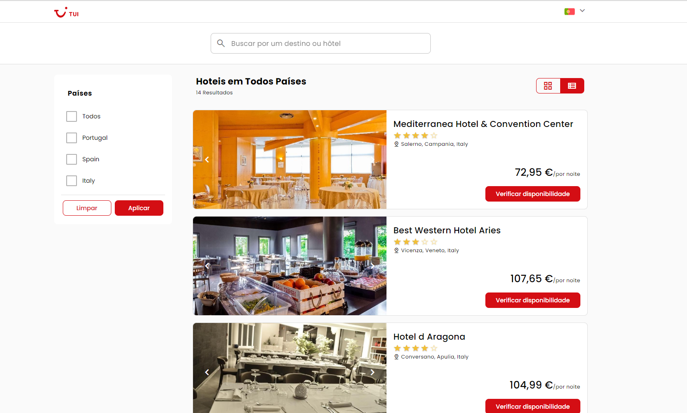

# 📄Tui test frontend

### 🚀Teste de verificação de competência técnica

<h1 align="center"> <a href="https://tuistay.vercel.app/hotels">🔗 Acessar</a></h1>

<p align="center"></p>

## Project setup

```
yarn install
```

### Compiles and hot-reloads for development

```
yarn serve
```

### Compiles and minifies for production

```
yarn build
```

### Run your unit tests

```
yarn test:unit
```

### Run your end-to-end tests

```
yarn test:e2e
```

### Lints and fixes files

```
yarn lint
```

### Customize configuration

See [Configuration Reference](https://cli.vuejs.org/config/).

### 🛠 Tecnologias

As seguintes ferramentas foram usadas na construção do projeto:

- [Vue js](https://expo.io/)
- [Node.js](https://nodejs.org/en/)
- [Vuex](https://vuex.vuejs.org/)
- [Vue Router](https://router.vuejs.org/)
- [TypeScript](https://www.typescriptlang.org/)
- [Quasar Framework](https://quasar.dev/)
- [Vue I18n](https://kazupon.github.io/vue-i18n/)
- [Vue test utils](https://v1.test-utils.vuejs.org/)
